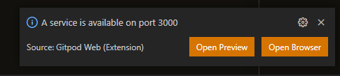
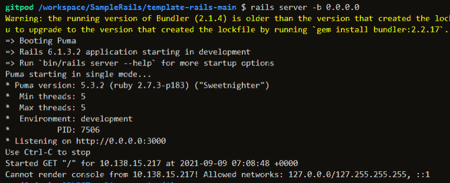
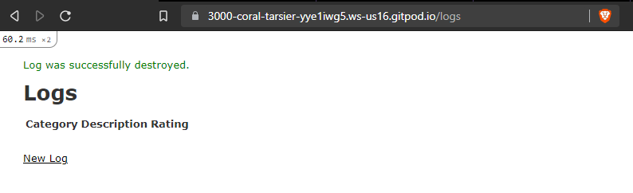
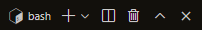
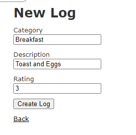
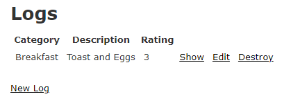
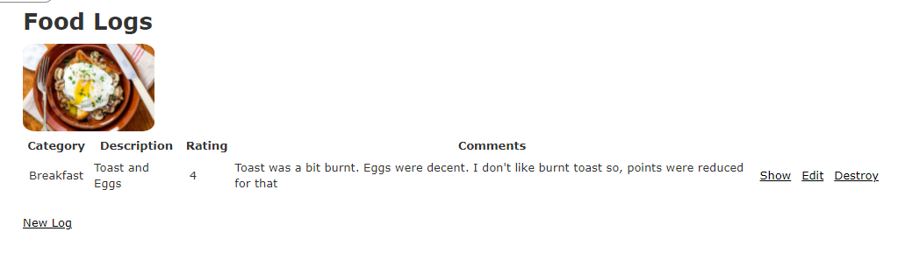

# Micro Task

## Context
The purpose of this micro task is to simulate a workflow within a Ruby-on-Rails web application. This task requires knowledge and familiarity of Model-View-Controller (MVC) and common git commands. Prior knowledge of Ruby-on-Rails is not required. Although this application uses Ruby-on-Rails, understanding where to edit the code is the most important.

## Setup Instructions
We will be using Gitpod and Visual Studio Code for this task. 
Prepend `gitpod.io/#` to the url of this repository. Another tab will open, launching the gitpod instance.

Like this:

    gitpod.io/#https://github.com/takumifuji09/SampleRails

Visual Studio Code will pop-up in the browser. This will be the coding environment for this task.

Type in the following commands in bash, within the in-built terminal of Visual Studio Code.

    cd template-rails-main/

Install packages and dependencies (~5 minutes)

    bundle install
    rails webpacker:install

Create Database and migrate

    rake db:create db:migrate

Start the application

    rails server -b 0.0.0.0

At this point, there should be a prompt at the bottom right of the screen. Click on "Open Preview" or "Open Browser" to open up the "localhost" instance of the application.

Alternatively, you may also click on the link that comes up in the terminal.

You should be able to see something like this:

### Git and Task Submission
Create another branch labelled as your name. You may click on the icon beside the trash bin to split your terminal, so that you can use git on one side and view the instance logs on another.

For e.g

    git checkout -b <name>

Create a sample txt file, stage it, commit it and push it.
Double check if the push is successful in the repository on Github.

## Task
Currently there is an existing "Log" table with 4 attributes: Category, Description, Ranking. We will be making adjustments to the table, and the view of the page in the following tasks.

This is a general table for logging data, but in this task we want to log food data. Click on new log and fill in the following content in the fields to try it out.

Sample:

There are a total of 3 sub tasks. Most of the relevant files and components required for this task has been generated for you.

### 1. Change "Logs" to "Food Logs"
We want this table to specifically log food. Change the header from "Logs" to "Food Logs".

### 2. Add Food Image
Add an image of your favourite food right below the header. You might need to style it.
It is recommended to do this in the "Rails way". Refer to the Rails documentation on how to do that.

### 3. Add an Attribute "Comments" to the table
Add another string attribute named "Comments" to the existing table. All other functions such as `show`, `edit`, `destroy` and `New log` should function properly.

The rails command to generate a new migration is:

    rails g migration <name_of_migration_file>

Stop the instance, run the following command to migrate the new changes, and start the instance again to resume your work:

    rake db:drop db:create db:migrate

Refer to startup instructions for restarting the "localhost".

### Expected End Result
The end result of the application should look something like this:

### Bonus task (just for fun/ if you have time)
Style the table/ page and make it look good. Turn the links: `show`, `edit`, `destroy` and `New log` into buttons.
Feel free to style the page however you want it to.

Have Fun with Ruby-on-Rails! :)
